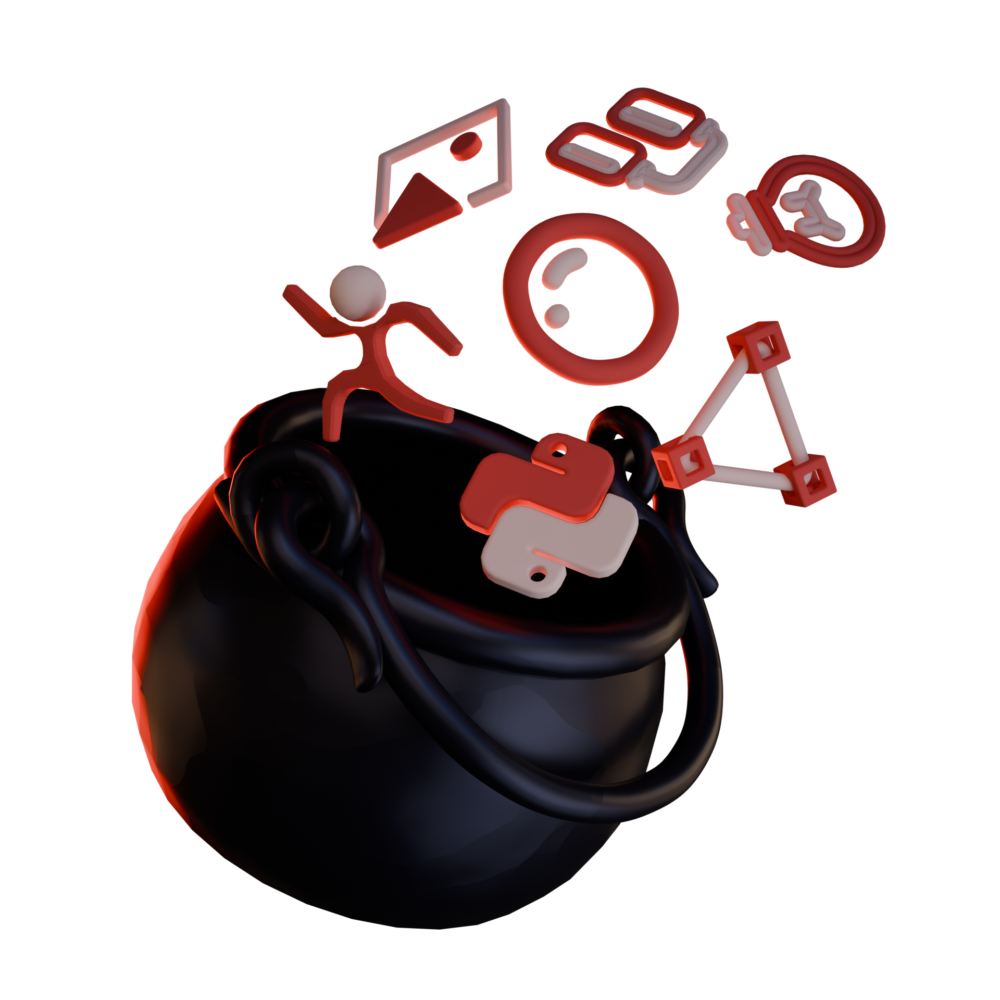

# Dagda's Cauldron
Un répertoire collaboratif d'outils, fichiers et scripts créés sur mesure, désormais partagés pour bénéficier à tous.

## Documentation
Read more on [DOCUMENTATION](./DOCUMENTATION.md)

### Rigs

* [Touche de piano dynamique](./Rigs/NICOLAS_Piano/) : détecte la pression via un geo node, qui enclenche un mécanisme présent sur le rig du piano. contient un script pour instancier les touches.